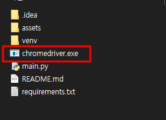
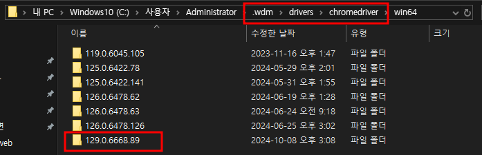
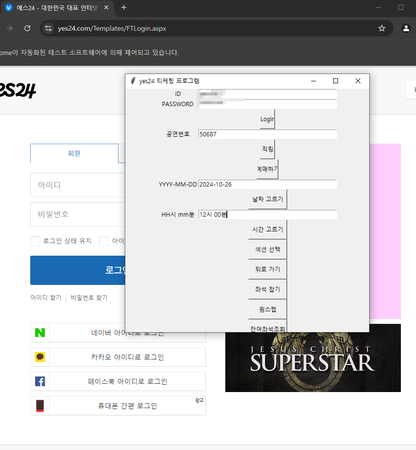

# :book: Manual

## 서비스 이용

1. `가상환경 설치` : python -m venv venv
2. `가상환경 입장` : source venv/scripts/activate
3. `필요라이브러리 설치` : pip install -r requirements.txt

---

## 크롬 환경세팅

1. **본인의 크롬 버전 확인**

   크롬 주소 창에 chrome://version

   

   

2. **크롬 드라이버 확보**

   보통 아래 경로에 사용하는 chromedriver.exe가 있다.

   

   path로 고생하고 싶지 않으면 동일 디렉토리에 chromedriver.exe를 복사해오자.

   

3. **서비스 실행**
   `python main.py`

   현재 테스트 상태로는 `로그인` ~ `시간고르기`까지 진행 가능.

   아래 기능은 개발했던 것으로 기억하나 확인 필요.

   

---

## :white_check_mark: TO DO

- [x] 로그인

- [x] WaitingPage - 직링, 예매하기

- [x] SchedulePage - 날짜고르기, 시간고르기

- [ ] SeatPage - 섹션선택, 좌석선택

  

  ### 고도화

- [ ] 각 스텝별 alert, error에 대한 유연한 예외처리

- [ ] 스텝별 구간 반복 기능

- [ ] 원스텝으로 통합하여 최종 구현하기

- [ ] 잔여좌석, 잔여티켓 - back단에서 api 통신

